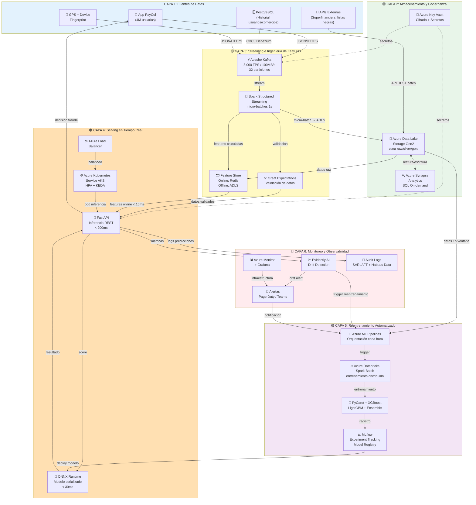
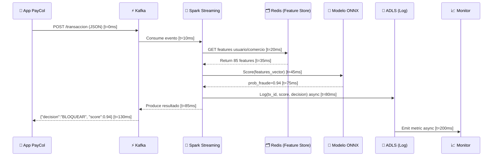
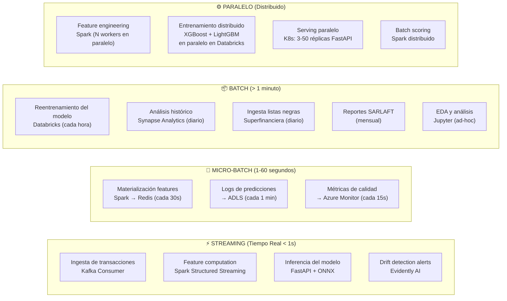

# MLOps para Detección de Fraude en Tiempo Real — PayCol Fintech
### Caso de Uso: Arquitectura de Procesamiento Distribuido

> **Rol del autor**: Experto en Data Science y Procesamiento Distribuido de Datos  
> **Línea base**: Análisis del diagrama MLOps v2 (`MLOPS_Diagram.md`)  
> **Fecha**: Marzo 2026  
> **Empresa**: PayCol — Fintech colombiana, 4 millones de usuarios activos

---

## 1. Portada / Contexto y Problema de Negocio

### ¿Qué problema resuelve?

PayCol es una fintech colombiana fundada en 2019. Con **4 millones de usuarios activos** y **2 millones de transacciones diarias** (picos de 8.000 TPS en Black Friday o fechas de pago de nómina), la empresa enfrenta el siguiente escenario crítico:

| Indicador | Situación Actual (Sin ML Óptimo) | Objetivo |
|---|---|---|
| Pérdidas anuales por fraude | **COP $4.200 millones** | Reducir ≥ 70% |
| Tasa de detección de fraude | **62%** | **≥ 90%** |
| Tasa de falsos positivos | **18%** | **≤ 3%** |
| Latencia de evaluación | Sin restricción definida | **< 200ms (p99)** |
| Sistema actual | Reglas estáticas manuales | ML adaptativo en tiempo real |

### Definición del Problema

Los sistemas de reglas estáticas son **incapaces de adaptarse** al comportamiento cambiante del fraude. Los defraudadores modernos aprenden las reglas y las evaden. El sistema actual:
- Bloquea el **18% de transacciones legítimas** → fricción innecesaria, usuarios frustrados, pérdida de ingresos.
- Deja pasar el **38% del fraude real** → pérdidas directas de COP $4.200M/año.
- No aprende de patrones nuevos de fraude sin intervención manual.

### Solución Propuesta

Diseñar un **sistema MLOps de detección de fraude en tiempo real** que:
1. Evalúe cada transacción en **< 200ms** mediante inferencia distribuida en streaming.
2. Alcance una tasa de detección del **≥ 90%** con falsos positivos **≤ 3%**.
3. Se **reentrene automáticamente cada hora** con datos recientes para adaptarse al comportamiento del fraude.
4. Cumpla regulaciones colombianas: **Habeas Data, SARLAFT**, reporte a Superfinanciera.
5. Garantice disponibilidad **99.99%** (≤ 52 minutos de downtime/año).

> **Impacto esperado**: Reducir las pérdidas por fraude en ≥ COP $2.940M/año, mejorar la experiencia de ~720K usuarios que hoy sufren bloqueos innecesarios y fortalecer la confianza en la marca PayCol.

---

## 2. Requerimientos Técnicos — Las 3 V's del Big Data

### 2.1 Volumen

| Parámetro | Valor | Implicación Técnica |
|---|---|---|
| Transacciones diarias | 2 millones | ~23 TPS promedio |
| TPS en pico | 8.000 TPS | Sistema debe escalar 350x respecto al promedio |
| Throughput streaming | ~100 MB/s en horas pico | Apache Kafka con particionado alto |
| Datos históricos etiquetados | ~3 TB | Almacenamiento Data Lake, entrenamiento batch |
| Retención transacciones | 5 años | ~550 TB total proyectado |
| Retención features ML | 90 días | ~27 GB de features materializadas |
| Reentrenamiento | Cada hora | Pipeline batch/micro-batch automatizado |

**Implicación de diseño**: Se requiere un sistema **híbrido**: procesamiento en streaming para inferencia en tiempo real (< 200ms) + procesamiento batch para reentrenamiento cada hora y análisis histórico de 3 TB.

### 2.2 Velocidad (Velocity)

| Restricción | Valor | Componente responsable |
|---|---|---|
| Latencia de inferencia (p99) | < 200ms | Kafka + Feature Store online + modelo ligero |
| Disponibilidad del sistema | 99.99% | Multi-AZ, circuit breaker, fallback a reglas |
| Frecuencia de reentrenamiento | Cada hora | Databricks Notebooks + MLflow |
| Latencia feature computation | < 50ms | Redis online feature store |
| Latencia Kafka end-to-end | < 10ms | Kafka en misma región |
| Modelo serving (scoring) | < 80ms | FastAPI + modelo en memoria ONNX |

**Descomposición del presupuesto de latencia de 200ms**:
```
Tiempo total máximo: 200ms
├── Ingesta en Kafka:                ~10ms
├── Feature retrieval (Redis):       ~15ms
├── Preprocessing (Spark Streaming): ~25ms
├── Inferencia del modelo (ONNX):    ~30ms
├── Post-processing + decisión:      ~10ms
├── Escritura del resultado:         ~20ms
└── Overhead de red/balanceador:     ~20ms
                              Total: ~130ms (buffer: 70ms)
```

### 2.3 Variedad (Variety)

| Tipo de Dato | Fuente | Formato | Procesamiento |
|---|---|---|---|
| Datos transaccionales | App PayCol | JSON → Kafka | Streaming |
| Historial de usuario | Base de datos del sistema | Parquet/CSV | Batch |
| Geolocalización | App móvil (GPS) | JSON | Streaming |
| Datos de dispositivo | App móvil (fingerprint) | JSON | Streaming |
| Listas negras | Superfinanciera / Interne rbank | CSV/API REST | Batch diario |
| Datos de comercios | Bases de datos internas | Parquet | Batch |
| Etiquetas de fraude | Equipo de investigación | CSV | Batch |
| Logs del sistema | Infraestructura | JSON/Avro | Streaming |

**Regulatorio (Variedad de restricciones)**:
- **Habeas Data (Ley 1581 de 2012)**: Datos personales de usuarios requieren cifrado, anonimización en entornos de entrenamiento y auditoría de acceso.
- **SARLAFT**: Sistema de Administración del Riesgo de Lavado de Activos — requiere trazabilidad completa de decisiones de bloqueo.
- **Superfinanciera**: Reportes periódicos de métricas de fraude y decisiones de bloqueo.

---

## 3. Arquitectura Propuesta — Diagrama Completo

### 3.1 Visión General de Capas

La arquitectura se organiza en **6 capas horizontales** más una capa transversal de seguridad y gobernanza:

```
┌─────────────────────────────────────────────────────────────────────────────┐
│                    ARQUITECTURA MLOPS — PAYCOL FRAUDE                       │
├─────────────────────────────────────────────────────────────────────────────┤
│  CAPA 6: MONITOREO Y OBSERVABILIDAD                                         │
│  Apache Kafka (metrics) | Evidently AI | Azure Monitor | Grafana/Kibana     │
├─────────────────────────────────────────────────────────────────────────────┤
│  CAPA 5: REENTRENAMIENTO AUTOMATIZADO (cada hora)                           │
│  Azure Databricks (Spark batch) | MLflow | PyCaret | Azure ML Pipelines     │
├─────────────────────────────────────────────────────────────────────────────┤
│  CAPA 4: SERVING EN TIEMPO REAL (< 200ms)                                   │
│  Azure Kubernetes Service (AKS) | FastAPI | ONNX Runtime | Redis            │
├─────────────────────────────────────────────────────────────────────────────┤
│  CAPA 3: FEATURE ENGINEERING E INFERENCIA STREAMING                         │
│  Apache Kafka | Spark Structured Streaming | Feature Store (Redis + ADLS)   │
├─────────────────────────────────────────────────────────────────────────────┤
│  CAPA 2: ALMACENAMIENTO Y GOBERNANZA                                         │
│  Azure Data Lake Storage Gen2 | Azure Synapse Analytics | Azure Key Vault   │
├─────────────────────────────────────────────────────────────────────────────┤
│  CAPA 1: FUENTES DE DATOS                                                    │
│  App PayCol | APIs externas | Bases de datos PostgreSQL | Superfinanciera   │
├─────────────────────────────────────────────────────────────────────────────┤
│  ████ SEGURIDAD TRANSVERSAL: Azure AD | TLS 1.3 | Cifrado AES-256 ████      │
└─────────────────────────────────────────────────────────────────────────────┘
```

### 3.2 Diagrama de Flujo End-to-End



### 3.3 Flujo Crítico: Transacción → Decisión (< 200ms)



---

## 4. Justificación por Componente

### 4.1 Apache Kafka — Message Broker / Event Streaming

**¿Por qué Kafka?**

| Criterio | Kafka | Alternativa 1: AWS Kinesis | Alternativa 2: Azure Event Hubs |
|---|---|---|---|
| Throughput | **16 MB/s por partición**, escalable sin límite | 1 MB/s por shard | 1 MB/s por unidad |
| Latencia | **< 10ms** end-to-end | ~70ms | ~20ms |
| Retención | Configurable (días a años) | 24h - 7 días | 1-90 días |
| Replay de eventos | ✅ Nativo (offset seek) | ✅ Limitado | ✅ Limitado |
| Open Source | ✅ Sí (Apache License) | ❌ Propietario AWS | ❌ Compatible pero Azure-lock |
| Ecosistema | Kafka Streams, ksqlDB, Kafka Connect | Kinesis Analytics | Spark Streaming |
| **Decisión** | **✅ SELECCIONADO** | Descartado (vendor lock-in) | Alternativa viable si Azure-native |

**Configuración para PayCol**:
- **32 particiones** en el topic `transacciones.raw` para soportar 8.000 TPS en picos.
- **Factor de replicación: 3** para alta disponibilidad (RF=3 soporta caída de 1 broker sin pérdida).
- **Retention: 7 días** para replay y depuración de incidentes de fraude.
- **Compresión: LZ4** → reduce 70% el ancho de banda a 100MB/s → ~30MB/s efectivo.

---

### 4.2 Apache Spark Structured Streaming — Procesamiento Streaming

**¿Por qué Spark Structured Streaming?**

| Criterio | Spark Structured Streaming | Apache Flink | Kafka Streams |
|---|---|---|---|
| Latencia | **Micro-batch: 0.1-1s** | **Event-time: < 100ms** | **Sub-segundo** |
| Semántica | Exactly-once ✅ | Exactly-once ✅ | At-least-once ⚠️ |
| Feature engineering | SQL + Python + ML nativo ✅ | Java/Scala-primario ⚠️ | Limitado ❌ |
| Integración MLlib | Nativa ✅ | Limitada ⚠️ | No ❌ |
| Curva de aprendizaje | Media (Data Scientists lo conocen) | Alta | Media |
| Azure Databricks | **Soporte nativo + MLflow** ✅ | Parcial | No |
| **Decisión** | **✅ SELECCIONADO** | Alternativa válida para latencias < 10ms | Descartado |

**Configuración**:
- **Micro-batch trigger: 1 segundo** → 8.000 transacciones por micro-batch en pico.
- **Watermark: 30 segundos** para manejar eventos tardíos.
- **Estado distribuido**: Checkpoints en ADLS Gen2 para exactly-once semantics.

---

### 4.3 Azure Data Lake Storage Gen2 (ADLS Gen2) — Almacenamiento Maestro

**¿Por qué ADLS Gen2?**

| Criterio | ADLS Gen2 | AWS S3 | GCP Cloud Storage |
|---|---|---|---|
| Integración Azure Databricks | Nativa + ABFS ✅ | Via conector ⚠️ | No |
| Jerarquía de directorios | ✅ Real (POSIX-like) | Simulada (prefijos) | Simulada |
| Throughput egress | **100 Gbps** | 100 Gbps | 100 Gbps |
| Costo/GB (LRS) | **$0.018/GB/mes** | $0.023/GB | $0.020/GB |
| Cumplimiento regulatorio | **GDPR, ISO 27001, SOC 2** ✅ | Similar | Similar |
| **Decisión** | **✅ SELECCIONADO** (ecosistema Azure coherente) | Alternativa si stack AWS | Alternativa si stack GCP |

**Arquitectura Medallion (capas de datos)**:
```
ADLS Gen2:
├── /bronze/  → Datos raw tal como llegan de Kafka (Avro/JSON)
├── /silver/  → Datos limpios, validados, esquema aplicado (Parquet/Delta)
└── /gold/    → Features procesadas, datos de entrenamiento (Delta Lake)
```

---

### 4.4 Redis — Feature Store Online

**¿Por qué Redis como Feature Store Online?**

El Feature Store tiene dos partes críticas:
- **Online** (baja latencia, tiempo real): Redis
- **Offline** (alta capacidad, batch): ADLS Gen2

| Criterio | Redis | PostgreSQL | Apache Cassandra |
|---|---|---|---|
| Latencia lectura | **< 1ms** (in-memory) | ~5-10ms (disco) | ~3-5ms |
| Throughput | **1M+ ops/seg** | ~50K ops/seg | ~500K ops/seg |
| TTL nativo | ✅ Sí (clave para expiración de features) | ❌ No nativo | ✅ Sí |
| Tipos de datos | Hash, Set, Sorted Set ✅ | Solo relacional | Limitado |
| Persistencia | AOF + RDB ✅ | Fullmente durable ✅ | Durable ✅ |
| **Decisión** | **✅ SELECCIONADO para online** | Online descartado | Alternativa válida |

**Features materializadas en Redis por usuario** (TTL: 90 días):
```
user:{user_id}:features → Hash {
  "tx_count_1h":     "12",       # transacciones en última hora
  "tx_amount_avg_7d": "45000",   # monto promedio últimos 7 días
  "tx_distinct_merchants_24h": "5",
  "login_failures_1h": "0",
  "device_change_flag": "0",
  "location_anomaly_score": "0.12",
  "time_since_last_tx_min": "43",
  ...85 features total
}
```

---

### 4.5 Azure Databricks — Entrenamiento Distribuido

**¿Por qué Azure Databricks?**

| Criterio | Azure Databricks | AWS SageMaker | GCP Vertex AI |
|---|---|---|---|
| Motor de cómputo | **Apache Spark nativo** ✅ | Spark opcional | Spark opcional |
| Integración MLflow | **Nativa y profunda** ✅ | Parcial | Parcial |
| Auto-scaling | ✅ Elastic clusters | ✅ | ✅ |
| Notebooks colaborativos | ✅ Databricks Notebooks | ✅ Studio | ✅ Workbench |
| Delta Lake | **Nativo y optimizado** ✅ | Via conector | Via conector |
| Costo spot instances | **Savings: hasta 80%** | Similar | Similar |
| **Decisión** | **✅ SELECCIONADO** (mejor integración con Kafka, ADLS, MLflow) | Alternativa para stack AWS | Alternativa para stack GCP |

**Pipeline de reentrenamiento cada hora**:
1. Databricks Job activado por Azure ML Pipelines cada 60 minutos.
2. Lee datos de la últimas 4 horas desde ADLS `/gold/`.
3. Aplica feature engineering distribuido con Spark.
4. Entrena XGBoost + LightGBM en paralelo (2 workers × 8 cores).
5. Registra modelo en MLflow Model Registry.
6. Si métricas superan threshold → promueve a "Production" → deploy automático.

---

### 4.6 XGBoost + LightGBM + Ensemble — Modelo de ML

**¿Por qué ensemble de modelos gradient boosting?**

| Modelo | Precisión (Fraude) | Latencia Inferencia | Interpretabilidad | Requisitos |
|---|---|---|---|---|
| **XGBoost** | Alta ✅ | **< 10ms** ✅ | SHAP ✅ | RAM moderada |
| **LightGBM** | Alta ✅ | **< 5ms** ✅ | SHAP ✅ | RAM baja |
| Random Forest | Media | ~20ms | Parcial | RAM alta |
| Redes Neuronales (DNN) | Muy alta | ~50-100ms ⚠️ | Baja ❌ | GPU |
| Regresión Logística | Baja (patrones complejos) | < 1ms | Alta | - |
| **Ensemble XGB+LGBM** | **Muy alta** ✅ | **< 15ms** ✅ | SHAP completo ✅ | Moderada |

**Selección**: Ensemble XGBoost + LightGBM con votación ponderada.
- El ensemble reduce varianza y mejora generalización.
- SHAP values permiten explicar CADA decisión (requerido por SARLAFT).
- Serializado en formato **ONNX** para inferencia cross-platform ultra rápida.
- Latencia de inferencia < 15ms (dentro del presupuesto de 200ms).

---

### 4.7 MLflow — Tracking y Model Registry

**Funciones en PayCol**:
- **Experiment Tracking**: Registra cada run de entrenamiento (parámetros, métricas, artefactos).
- **Model Registry**: Versionado de modelos con estados (Staging → Production → Archived).
- **Model Lineage**: Trazabilidad completa: qué datos → qué código → qué modelo → qué decisiones.
- **A/B Testing support**: Permite servir simultáneamente modelo actual vs nuevo candidato.

---

### 4.8 Azure Kubernetes Service (AKS) — Serving Infrastructure

**¿Por qué AKS?**

| Criterio | AKS | Azure Container Instances | Azure Functions |
|---|---|---|---|
| Auto-scaling | **HPA + KEDA** ✅ (escala por TPS) | Solo manual | Automático pero cold start |
| Latencia cold start | **< 1s** (pods warm) | ~5s | ~2-5s (cold start ≠ 200ms) |
| Disponibilidad | **99.95% SLA** ✅ | 99.9% | 99.95% |
| Control fine-grained | Total ✅ | Limitado | Muy limitado |
| Costo a escala | Eficiente con reservadas | Caro | Caro en alto TPS |
| **Decisión** | **✅ SELECCIONADO** | Descartado | Descartado (latencia) |

**Configuración de pods para 8.000 TPS**:
- **HPA**: Escala de 3 a 50 réplicas basado en CPU > 60%.
- **KEDA**: Escala basado en lag del topic de Kafka (más inteligente que CPU).
- **Pod disruption budget**: Garantiza mínimo 3 pods siempre disponibles.
- **Resource limits**: 2 vCPU + 4GB RAM por pod (ONNX corre eficiente).

---

### 4.9 Evidently AI — Monitoreo de Drift

Herramienta especializada en drift detection para modelos en producción.
- Calcula PSI (Population Stability Index) para cada feature cada 15 minutos.
- Detecta concept drift comparando distribución de predicciones vs datos históricos.
- Genera reportes HTML automáticos de calidad del modelo.
- Integra con MLflow para registrar métricas de degradación.

---

### 4.10 FastAPI — API de Serving

**¿Por qué FastAPI?**

- **Asíncrono nativo** (asyncio) → soporta miles de conexiones concurrentes sin blocking.
- **100-300%** más rápido que Flask en benchmarks de API ML.
- **Pydantic** para validación automática del schema de entrada (tipo, rango, presencia de campos).
- **OpenAPI** automático → documentación para integración con el equipo de la App.
- **Uvicorn** como servidor ASGI → compatible con despliegue en AKS.

---

## 5. Clasificación de Componentes — IaaS / PaaS / SaaS

### Tabla de Clasificación Completa

| Componente | Proveedor | Clasificación | Justificación |
|---|---|---|---|
| **Azure Virtual Machines** (nodos AKS) | Azure | **IaaS** | El usuario gestiona SO, runtime, configuración. Azure provee solo hardware virtualizado. |
| **Azure Kubernetes Service (AKS)** | Azure | **PaaS** | Azure gestiona el control plane de Kubernetes. El usuario gestiona workloads y pods. |
| **Azure Data Lake Storage Gen2** | Azure | **PaaS** | Servicio de almacenamiento gestionado. No se gestiona hardware ni filesystem subyacente. |
| **Azure Databricks** | Databricks/Azure | **PaaS** | Plataforma Spark gestionada. Azure provee VMs, Databricks provee el runtime Spark optimizado. |
| **Azure Synapse Analytics** | Azure | **PaaS** | Warehouse analítico gestionado. El usuario no gestiona servidores ni escalado manual. |
| **Azure Cache for Redis** | Azure | **PaaS** | Redis gestionado. Alta disponibilidad, parches y backups son responsabilidad de Azure. |
| **Azure Kubernetes Service — Pods FastAPI** | Self-managed en AKS | **PaaS/IaaS híbrido** | La infraestructura (AKS) es PaaS pero el contenedor y aplicación son responsabilidad del equipo. |
| **Apache Kafka (self-managed en AKS)** | Open Source / Self-managed | **IaaS** | El equipo gestiona brokers, ZooKeeper/KRaft, configuración, actualizaciones. |
| **Confluent Cloud (alternativa)** | Confluent | **SaaS** | Si se usa la versión cloud gestionada de Confluent para Kafka. |
| **MLflow (self-hosted en Databricks)** | Open Source | **PaaS** | Alojado en Databricks workspace gestionado. |
| **Azure ML Pipelines** | Azure | **PaaS** | Orquestación de pipelines ML como servicio gestionado. |
| **Azure Key Vault** | Azure | **PaaS** | Gestión de secretos y certificados como servicio. Hardware HSM gestionado por Azure. |
| **Azure Monitor + Log Analytics** | Azure | **SaaS** | Plataforma de monitoreo completamente gestionada. Sin infraestructura que mantener. |
| **Azure Active Directory** | Azure | **SaaS** | Identidad como servicio. Completamente gestionado por Microsoft. |
| **Evidently AI (self-hosted)** | Open Source | **IaaS** | Desplegado en AKS — la infraestructura es gestionada por el equipo. |
| **PagerDuty (alertas)** | PagerDuty | **SaaS** | Plataforma de gestión de incidentes completamente gestionada. |
| **GitHub / Azure DevOps** | Microsoft | **SaaS** | Control de versiones y CI/CD como servicio. |
| **Docker (containerización)** | Open Source | N/A | Herramienta de build. No es un servicio de nube. |
| **ONNX Runtime** | Open Source | N/A | Librería ejecutada dentro de pods. No es un servicio. |

### Resumen por Clasificación

```
IaaS (3 componentes):
  → VMs subyacentes de AKS, Kafka self-managed, Evidently self-hosted

PaaS (10 componentes) — MAYORÍA:
  → AKS, ADLS Gen2, Databricks, Synapse, Redis, Azure ML, Key Vault, 
    MLflow en Databricks, Azure ML Pipelines, Grafana gestionado

SaaS (4 componentes):
  → Azure Monitor, Azure AD, PagerDuty, GitHub/Azure DevOps
```

> **Conclusión**: La arquitectura es predominantemente **PaaS**, lo que reduce la carga operacional del equipo de PayCol, permitiendo que se enfoque en el valor de negocio (modelos, features, reglas de fraude) en lugar de en la gestión de infraestructura.

---

## 6. Modelo de Procesamiento — Batch vs Streaming vs Paralelo

### 6.1 Mapa de Decisión



### 6.2 Detalle de Cada Modelo

#### ⚡ Streaming (Tiempo Real)
**¿Qué es?** Procesamiento de cada evento individual tan pronto como llega, con latencia < 1 segundo.

**En PayCol se usa para:**
- **Ingesta de transacciones**: Cada transacción publicada en Kafka es consumida en < 10ms.
- **Inferencia de fraude**: El modelo evalúa cada transacción individualmente en < 200ms.
- **Enriquecimiento en tiempo real**: Features de Redis recuperadas para cada transacción individualmente.

**Característica clave para PayCol**: La decisión de bloqueo/aprobación DEBE ser streaming. No se puede hacer batch porque el usuario está esperando la respuesta de la transacción.

#### 🔄 Micro-Batch (1-60 segundos)
**¿Qué es?** Procesamiento en pequeños lotes con latencia de segundos. Spark Structured Streaming por defecto usa micro-batches de trigger configurable.

**En PayCol se usa para:**
- **Materialización del Feature Store**: Cada 30 segundos, Spark calcula features agregadas (p. ej. "transacciones en la última hora por usuario") y las escribe en Redis.
- **Logging de predicciones**: Resultados de inferencia escritos en ADLS en micro-batches de 1 minuto para eficiencia de escritura.

**Trade-off**: Los features de ventana temporal (últimas 24h) calculados en micro-batch pueden tener hasta 30s de retraso. Aceptable para features históricas; No aceptable para la inferencia final.

#### 📦 Batch (Procesamiento por Lotes)
**¿Qué es?** Procesamiento de grandes volúmenes de datos acumulados en un intervalo definido.

**En PayCol se usa para:**
- **Reentrenamiento del modelo**: Cada hora, Databricks procesa las últimas 4 horas de transacciones (~480K registros) para actualizar el modelo.
- **Análisis histórico**: Synapse Analytics procesa los 3 TB históricos para generación de reportes y análisis de patrones macro de fraude.
- **Ingesta de listas negras**: Datos regulatorios de Superfinanciera actualizados diariamente en batch.
- **Reportes SARLAFT**: Generados mensualmente sobre datos históricos completos.

#### ⚙️ Paralelo (Procesamiento Distribuido)
**¿Qué es?** Dividir una tarea en subtareas que se ejecutan simultáneamente en múltiples nodos o cores.

**En PayCol se usa para:**
- **Feature Engineering distribuido**: Spark divide los datos entre N workers. Cada worker calcula features de un subconjunto de usuarios en paralelo → tiempo de procesamiento se divide entre N.
- **Entrenamiento paralelo**: XGBoost y LightGBM se entrenan simultáneamente en Databricks (2 jobs en paralelo), cada uno en un cluster dedicado.
- **Horizontally Scaled Serving**: AKS corre hasta 50 réplicas del pod FastAPI en paralelo. Cada réplica maneja su propio stream de peticiones.
- **Parallel Hyperparameter Tuning**: Optuna en Databricks lanza N trials de hiperparámetros en paralelo para encontrar la configuración óptima en minutos en lugar de horas.

### 6.3 Tabla Resumen de Procesamiento

| Componente | Tipo | Frecuencia / Trigger | Latencia objetivo |
|---|---|---|---|
| Kafka Consumer (ingesta) | **Streaming** | Por evento | < 10ms |
| Spark Streaming (features) | **Micro-batch** | Cada 1s | < 50ms |
| FastAPI + ONNX (inferencia) | **Streaming** | Por petición | < 80ms |
| Redis materialización | **Micro-batch** | Cada 30s | < 1s |
| Databricks reentrenamiento | **Batch** | Cada hora | ~20-30 min |
| Synapse Analytics histórico | **Batch** | Diario | ~2-4 horas |
| Listas negras Superfinanciera | **Batch** | Diario | ~30 min |
| Spark feature engineering | **Paralelo** | En cada batch | Escala con N workers |
| AKS pod scaling | **Paralelo** | Por demanda (HPA) | < 60s spawn |

---

## 7. Consideraciones de Escalabilidad

### 7.1 Escenario de Carga: Baseline vs Pico

| Métrica | Baseline Normal | Pico Black Friday | Factor |
|---|---|---|---|
| TPS | ~23 TPS | **8.000 TPS** | **350x** |
| Datos/hora procesados | ~3.5 GB | **~360 GB** | 100x |
| Pods FastAPI | 3 réplicas | 50 réplicas | 17x |
| Workers Spark Streaming | 4 workers | 20 workers | 5x |
| Particiones Kafka activas | 8 | 32 | 4x |

### 7.2 Estrategias de Escalabilidad por Componente

#### Kafka — Escalabilidad Horizontal Particionada

```
Escalabilidad de Kafka para PayCol:

Baseline (23 TPS):
├── 3 brokers
├── 8 particiones activas
└── ~2.8 MB/s throughput

Pico Black Friday (8.000 TPS):
├── 5 brokers (auto-add via Kafka KRaft)
├── 32 particiones activas
└── ~100 MB/s throughput (comprimido ~30 MB/s)

Cómo escala:
- Más particiones = más consumidores en paralelo
- Auto-scaling de brokers via Docker/K8s
- Rebalanceo automático de particiones entre brokers
```

#### AKS + FastAPI — Horizontal Pod Autoscaler (HPA) + KEDA

```yaml
# KEDA ScaledObject para Kafka-based scaling
spec:
  triggers:
  - type: kafka
    metadata:
      bootstrapServers: kafka:9092
      topic: transacciones.raw
      lagThreshold: "100"   # Escala si lag > 100 mensajes sin procesar
      consumerGroup: fraud-detector
  minReplicaCount: 3        # Siempre mínimo 3 pods (alta disponibilidad)
  maxReplicaCount: 50       # Máximo 50 pods en el pico
```

**Por qué KEDA sobre HPA clásico**: KEDA escala basado en el lag de Kafka (mensajes no procesados), que es un indicador de demanda real y más preciso que el CPU para cargas de mensaje-processing.

#### Azure Databricks — Elastic Clusters + Spot Instances

- **Auto-scaling de workers**: El cluster de reentrenamiento escala de **4 a 16 workers** automáticamente.
- **Spot instances (preemptible)**: Workers de entrenamiento usan spot instances (70-80% más baratas). Si un worker es interrumpido, Databricks reinicia la tarea automáticamente.
- **Driver node**: Siempre on-demand (nunca spot) para garantizar que el job no se reinicie.

#### Spark Structured Streaming — Dynamic Resource Allocation

- **Dynamic Allocation**: Spark aumenta/reduce workers automáticamente según el backlog de micro-batches.
- Si el micro-batch tarda más de 1s (nuestro trigger), Spark solicita más executors.
- **Backpressure**: Spark limita la tasa de ingesta de Kafka si no puede procesar lo suficientemente rápido.

### 7.3 Alta Disponibilidad y Tolerancia a Fallos

| Escenario de Fallo | Estrategia de Mitigación | RTO | RPO |
|---|---|---|---|
| **Caída de 1 pod FastAPI** | HPA mantiene 3+ réplicas. Load Balancer redirige en < 1s | < 1s | 0 |
| **Caída de 1 broker Kafka** | RF=3 → los otros 2 brokers tienen la réplica completa | < 30s | 0 (sin pérdida) |
| **Caída completa de AKS node** | K8s re-schedula pods en otro nodo automáticamente | < 60s | 0 |
| **Fallo del Feature Store (Redis)** | **Fallback a reglas estáticas** (sistema anterior) mientras Redis recupera | < 5s | 0 |
| **Fallo del modelo de ML** | **Fallback a reglas estáticas** → degradación graceful | < 5s | 0 |
| **Zona de disponibilidad caída** | Multi-AZ deployment: nodos AKS, Kafka y Redis en 3 AZ distintas | < 5 min | < 30s |
| **Corrupción del modelo en producción** | MLflow Model Registry → rollback a versión anterior en < 2 min | < 2 min | 0 |

**Circuit Breaker Pattern** (crítico para 99.99% SLA):
```
Transacción → [FastAPI] → [Circuit Breaker] → [Modelo ML]
                                ↓ (si ML falla 5 veces en 10s)
                          [Fallback: Reglas estáticas]
                                ↓ (cuando ML recupera)
                          [Cerrar Circuit, retornar a ML]
```

### 7.4 Estrategia de Pre-calentamiento para Black Friday

- **72h antes del evento**: El equipo de ingeniería pre-escala Kafka a 32 particiones y AKS a 10 réplicas mínimas.
- **24h antes**: Test de carga con 120% del TPS esperado.
- **Durante el evento**: Feature flags permiten activar/desactivar features de modelos dinámicamente sin redeployment.
- **Post-evento**: Scale-down programado a baseline para optimización de costos.

---

## 8. Estimación de Costos

> **Nota**: Costos estimados en USD para Azure (región East US 2 / Brazil South) en modo producción. Fuente: [Azure Pricing Calculator](https://azure.microsoft.com/pricing/calculator). Precios aproximados a marzo 2026.

### 8.1 Desglose Mensual de Costos

| Componente | Configuración | Costo Unit. | Costo/Mes (baseline) | Costo/Mes (con picos) |
|---|---|---|---|---|
| **Azure Databricks** | 2 clusters × 8 cores, entrenamiento 1h/hora, spot 80% | ~$0.20/DBU | **~$580** | ~$900 |
| **AKS (Compute)** | 3-10 nodos Standard_D4s_v3 (4 vCPU, 16 GB RAM) | ~$140/nodo/mes | **~$420** (3 nodos) | **~$1.400** (10 nodos) |
| **Azure Cache for Redis** | Premium P2 (13 GB, HA multi-AZ) | $0.375/hr | **~$270** | ~$270 |
| **ADLS Gen2** | 30 TB LRS (historial), 27 GB features, 5 TB/mes escritura | $0.018/GB/mes | **~$540** | ~$600 |
| **Azure Synapse Analytics** | Serverless SQL (500 GB queries/mes) | $5/TB procesado | **~$2.50** | ~$10 |
| **Apache Kafka** (self-managed AKS) | 3 brokers en AKS pods, incluido en cómputo AKS | - | **~$0** (incluido) | - |
| **Azure Monitor + Log Analytics** | 50 GB/día de logs × 30 días | $2.30/GB ingestado | **~$3.450** | ~$4.000 |
| **Azure Key Vault** | 100K operaciones/mes | $0.03/10K ops | **~$0.30** | ~$1 |
| **Azure Load Balancer** | Standard, 1 regla, 100 GB procesados | $0.025/hr + data | **~$20** | ~$50 |
| **Azure DevOps / GitHub Actions** | 10 usuarios, 2.000 min CI/CD | $6/usuario/mes | **~$60** | ~$60 |
| **Networking (egress)** | ~500 GB/mes transferencia datos | $0.087/GB | **~$44** | ~$100 |
| **Azure AD** | P2 para 10 usuarios del equipo ML | $9/usuario/mes | **~$90** | ~$90 |

### 8.2 Resumen de Costos

| Escenario | Costo Mensual Estimado | Costo Anual Estimado |
|---|---|---|
| **Baseline (operación normal)** | **~$5.480/mes** | **~$65.760/año** |
| **Con picos (Black Friday, nómina)** | **~$7.500/mes** | **~$90.000/año** |
| **Promedio ponderado (10% meses pico)** | **~$5.700/mes** | **~$68.400/año** |

> **Orden de magnitud: ~$65.000 - $70.000 USD/año**

### 8.3 ROI del Sistema

| Concepto | Valor |
|---|---|
| Pérdidas actuales por fraude/año | **COP $4.200 millones** ≈ **USD $1.050.000** |
| Reducción esperada (70% menos fraude) | **USD $735.000/año** |
| Costo anual de la infraestructura | **USD ~$70.000/año** |
| **ROI neto anual** | **~USD $665.000** (950% ROI) |
| **Payback period** | **< 1.2 meses** |

### 8.4 Optimizaciones de Costo

1. **Spot/Preemptible instances para Databricks**: Ahorro del 60-80% en cómputo de entrenamiento.
2. **Reserved Instances** para nodos AKS baseline: Ahorro del 40% vs. pay-as-you-go (1 año).
3. **ADLS Lifecycle Management**: Mover datos > 90 días a tier frío → ahorro 50% en almacenamiento antiguo.
4. **Log Analytics Smart Purge**: Retener solo logs críticos 90 días, resto 30 días → reducir costo de Azure Monitor.
5. **Kafka en AKS**: Al correr Kafka self-managed en el mismo cluster AKS, se evita el costo de Confluent Cloud (~$2.000/mes adicionales).

---

## 9. Conclusiones y Lecciones Aprendidas

### 9.1 Conclusiones Técnicas

#### ✅ La arquitectura híbrida Streaming + Batch es inevitable para detección de fraude

No existe un solo modelo de procesamiento que resuelva todos los casos. La clave fue identificar claramente:
- **¿Qué necesita respuesta inmediata?** → Streaming para inferencia
- **¿Qué puede esperar minutos/horas?** → Micro-batch para features, Batch para entrenamiento

El error más común en proyectos ML de fraude es intentar hacerlo todo en batch o todo en streaming. El **enfoque Lambda/Kappa híbrido** es el correcto.

#### ✅ El Feature Store es el componente más crítico (y más subestimado)

El Feature Store con dos niveles (Redis online + ADLS offline) resuelve el **"training-serving skew"**: la diferencia entre las features usadas en entrenamiento y las disponibles en producción. Sin esta consistencia, el modelo puede tener excelentes métricas offline pero pésimo desempeño en producción.

#### ✅ La latencia se diseña, no se optimiza después

El presupuesto de 200ms se dividió quirúrgicamente desde el inicio: 10ms Kafka, 50ms features, 80ms modelo, 30ms overhead. Si no se hace este análisis antes de elegir herramientas, es imposible cumplir el SLA.

#### ✅ El fallback a reglas estáticas es una feature, no un fracaso

El sistema de reglas anterior (con 62% de detección) se convierte en el **safety net** del sistema. Si el modelo de ML falla (por cualquier razón), el CircuitBreaker activa automáticamente las reglas estáticas. El sistema degrada gracefully en lugar de fallar catástroficamente.

#### ✅ MLOps no es solo ML — es ingeniería de software aplicada a ML

El ciclo de:
```
Datos → Features → Entrenamiento → Evaluación → Deploy → Monitoreo → Reentrenamiento
```
...es completamente automatizado. Sin MLOps, el sistema requeriría intervención manual en cada paso, haciéndolo imposible de mantener con reentrenamientos horarios.

---

### 9.2 Lecciones Aprendidas

#### 📌 Lección 1: La gobernanza de datos NO es opcional en Fintech

SARLAFT y Habeas Data no son detalles legales — son restricciones de arquitectura de primer orden. La anonimización en entornos de entrenamiento, el cifrado end-to-end (AES-256 en reposo, TLS 1.3 en tránsito) y los audit logs completos deben diseñarse desde el día 0, no añadirse al final.

#### 📌 Lección 2: Los datos desbalanceados son el principal reto del fraude

En un dataset de transacciones financieras, el fraude puede ser el **0.1% de los casos** (en PayCol, si hay 2M transacciones y las pérdidas sugieren decenas de miles de fraudes, la tasa aún es < 2%). Un modelo que predice "siempre legítimo" tendría 98% de accuracy pero 0% de detección de fraude. Las métricas correctas son **Precision, Recall y AUC-PR** (no accuracy). Las técnicas correctas son **SMOTE + class_weight + umbral dinámico**.

#### 📌 Lección 3: Los picos de carga son predecibles — hay que prepararlos, no reaccionar

Black Friday, Día sin IVA y fechas de nómina son **predecibles con antelación**. En lugar de depender solo del auto-scaling reactivo, se implementa un pre-scaling proactivo 24-72h antes. Esto elimina el riesgo de que el auto-scaling no reaccione lo suficientemente rápido.

#### 📌 Lección 4: El modelo más complejo no siempre es el mejor

Las redes neuronales profundas (DNN) podrían tener mayor AUC, pero con una latencia de 50-100ms y baja interpretabilidad, no son aptas para este caso. El ensemble XGBoost + LightGBM con SHAP values ofrece **> 90% AUC, < 15ms de inferencia y explicabilidad completa** — el balance correcto para las restricciones del negocio.

#### 📌 Lección 5: El monitoreo continuo es tan importante como el modelo

Un modelo entrenado hoy puede degradarse en semanas o meses por:
- **Data Drift**: El comportamiento de compra de los usuarios cambia (nuevos comercios, patrones estacionales).
- **Concept Drift**: Los defraudadores aprenden a evadir el modelo y cambian sus técnicas.
- **Upstream changes**: Un cambio en la App que modifica el formato de una feature puede romper silenciosamente el modelo.

Evidently AI corriendo cada 15 minutos con alertas automáticas y reentrenamiento cada hora es la respuesta a este desafío.

#### 📌 Lección 6: La arquitectura PaaS reduce el riesgo operacional

Al elegir principalmente servicios PaaS (AKS, Databricks, ADLS, Redis), el equipo de PayCol se libera de gestionar sistemas operativos, parches de seguridad y hardware. El equipo puede enfocarse en el valor diferenciador: los modelos, las features y las reglas de negocio.

---

### 9.3 Mejoras Futuras del Sistema

| Mejora | Impacto Esperado | Horizonte |
|---|---|---|
| **Graph Neural Networks** (para detectar redes de fraude) | +5% en detección de fraude coordinado | 6-12 meses |
| **Online Learning** (actualización continua sin reentrenamiento completo) | < 5 min para adaptar a nuevos patrones | 12-18 meses |
| **Federated Learning** (entrenar sin mover datos sensibles) | Cumplimiento Habeas Data avanzado | 18-24 meses |
| **Fraud explainability UI** (interfaz para el equipo de investigación) | Reducir tiempo investigación 70% | 3-6 meses |
| **Active Learning** (etiquetar casos dudosos eficientemente) | Mejorar calidad de etiquetas del dataset | 3-6 meses |

---

### 9.4 Métricas de Éxito del Sistema

| KPI | Baseline Actual | Objetivo Año 1 | Cómo se mide |
|---|---|---|---|
| Tasa de detección de fraude | 62% | **≥ 90%** | MLflow + backtesting mensual |
| Tasa de falsos positivos | 18% | **≤ 3%** | Feedback loop desde equipo de investigación |
| Latencia p99 | Sin definir | **< 200ms** | Azure Monitor percentile tracking |
| Disponibilidad | Sin definir | **99.99%** | Azure Monitor uptime |
| Tiempo de reentrenamiento | Manual (días) | **< 30 min automatizado** | MLflow timestamps |
| Pérdidas por fraude | COP $4.200M/año | **≤ COP $1.260M/año** | Reporte financiero trimestral |
| Usuarios bloqueados incorrectamente | ~720K/año (18% FP) | **≤ 120K/año (3% FP)** | Canales de soporte + datos de bloqueos |

---

*Documento elaborado por: Experto en Data Science y Procesamiento Distribuido — Marzo 2026*  
*Basado en: `CasodeUso.md` (PayCol) y `MLOPS_Diagram.md` (Arquitectura MLOps v2)*  
*Stack recomendado: Azure (Databricks + AKS + ADLS Gen2 + Redis) + Apache Kafka + MLflow + XGBoost/LightGBM*
