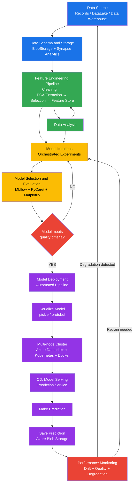

# Análisis Detallado del Diagrama MLOps v2

## Descripción General

El diagrama **MLOPs v2** representa una arquitectura completa de **Machine Learning Operations (MLOps)**, que describe el ciclo de vida end-to-end de un modelo de Machine Learning: desde la ingesta de datos hasta el despliegue en producción, la generación de predicciones y el monitoreo continuo del rendimiento.

La arquitectura se organiza en **tres grandes bloques funcionales** interconectados:

1. **Model Iterations** — Experimentación y entrenamiento iterativo
2. **Model Deployment** — Despliegue automatizado en producción
3. **Performance Monitoring** — Monitoreo y retroalimentación continua

Existe además una capa transversal de **Data Source / Data Schema and Storage** que alimenta todo el pipeline, y una capa de **Source Code Repository** y **Pipeline Deployment** que gestiona el control de versiones.

---

## 1. Data Source (Fuente de Datos)

```
┌──────────────────────────────────────────────────────┐
│  Records / Medical Histories | Public-Private | DataLake | Data Warehouse   │
└──────────────────────────────────────────────────────┘
```

### Descripción
El primer paso del pipeline es la identificación y conexión con las **fuentes de datos de origen**. Este bloque actúa como el punto de entrada de toda la información que alimentará el modelo.

### Componentes

| Fuente | Descripción |
|---|---|
| **Records / Medical Histories** | Datos estructurados de registros médicos o históricos, típicamente tablas transaccionales de alta sensibilidad. |
| **Public - Private** | Datasets de acceso público (p. ej. Kaggle, UCI) combinados con fuentes privadas propietarias de la organización. |
| **DataLake** | Repositorio de almacenamiento masivo de datos en crudo (raw), tanto estructurados como no estructurados, sin esquema fijo predefinido. |
| **Data Warehouse** | Almacén de datos limpios, transformados y estructurados, orientado al análisis analítico (OLAP). Suele almacenar datos históricos agregados. |

### Rol en el pipeline
Proporciona la materia prima para todo el flujo. Los datos aquí son **heterogéneos en formato y calidad**, lo que justifica el paso siguiente de almacenamiento y homogenización.

---

## 2. Data Schema and Storage (Esquema y Almacenamiento)

```
┌──────────────────────────────────────────┐
│  BlobStorage  |  Azure Synapse Analytics │
│         API Connectors                   │
└──────────────────────────────────────────┘
```

### Descripción
Este componente gestiona la **persistencia, acceso y gobernanza** de los datos una vez que son extraídos de las fuentes originales. Es el puente entre los datos crudos y el pipeline de ingeniería de features.

### Componentes

| Herramienta | Rol |
|---|---|
| **Azure Blob Storage** | Almacenamiento de objetos de bajo costo y alta escalabilidad en la nube de Microsoft Azure. Ideal para guardar archivos de datos en formatos como Parquet, CSV, JSON o imágenes. Actúa como Data Lake en escenarios de Azure. |
| **Azure Synapse Analytics** | Plataforma analítica unificada de Azure que combina capacidades de Data Warehouse (SQL dedicado) y Big Data (Spark). Permite consultas sobre datos estructurados y semiestructurados a escala de petabytes. |
| **API Connectors** | Conectores de integración que permiten ingestar datos en tiempo real o por lotes desde APIs externas (REST, GraphQL, Webhooks). Habilitan la ingesta de datos dinámicos y eventos externos. |

### Rol en el pipeline
Centraliza los datos para que sean **accesibles, versionados y gobernados** antes de ser procesados. Garantiza que el Feature Engineering Pipeline siempre trabaje sobre datos consistentes.

---

## 3. Feature Engineering Pipeline (Pipeline de Ingeniería de Características)

```
┌─────────────────────────────────────────────────────────────────────┐
│  Data Cleaning → PCA, Feature Extractions, Aggregations → Feature  │
│           Selection → Feature Store                                 │
│  Herramientas: pandas | NumPy | Jupyter | scikit-learn              │
└─────────────────────────────────────────────────────────────────────┘
```

### Descripción
Es el pipeline encargado de **transformar los datos brutos en features (características) de calidad** que luego alimentarán los modelos de ML. Es una de las etapas más críticas del ciclo MLOps porque la calidad del feature engineering impacta directamente la calidad del modelo.

### Etapas del pipeline

#### 3.1 Data Cleaning (Limpieza de Datos)
- Eliminación de valores nulos, duplicados e inconsistentes.
- Normalización de formatos (fechas, strings, tipos de dato).
- Detección y tratamiento de outliers.
- Corrección de errores de entrada de datos.

#### 3.2 PCA, Feature Extractions, Aggregations (Extracción y Transformación)
- **PCA (Principal Component Analysis)**: Técnica de reducción de dimensionalidad que transforma features correlacionadas en componentes ortogonales (independientes), preservando la mayor varianza posible. Reduce el "curse of dimensionality".
- **Feature Extractions**: Creación de nuevas variables a partir de las existentes (p. ej. extraer día de la semana de una fecha, calcular ratios financieros, embeddings de texto).
- **Aggregations**: Cálculo de estadísticas agregadas por grupo (suma, media, conteo, desviación estándar), especialmente útil en datos de series temporales o transaccionales.

#### 3.3 Feature Selection (Selección de Features)
- Elección de las variables más relevantes para el modelo usando técnicas como:
  - Filtros estadísticos (correlación de Pearson, chi-cuadrado, información mutua).
  - Métodos wrapper (Recursive Feature Elimination - RFE).
  - Métodos embedded (regularización L1/LASSO).
- Reducir el número de features mejora la generalización y reduce el tiempo de entrenamiento.

#### 3.4 Feature Store (Almacén de Features)
- Repositorio centralizado donde se almacenan y sirven las features procesadas.
- Permite la **reutilización de features** entre distintos modelos y equipos.
- Garantiza **consistencia entre entrenamiento y producción**: el modelo usa exactamente las mismas transformaciones en ambas fases.
- Ejemplo de herramientas: Feast, Tecton, Azure Feature Store.

### Herramientas utilizadas

| Herramienta | Uso |
|---|---|
| **pandas** | Manipulación y transformación de datos tabulares (DataFrames). |
| **NumPy** | Operaciones numéricas vectorizadas de alto rendimiento. |
| **Jupyter Notebooks** | Entorno interactivo para desarrollo y exploración de features. |
| **scikit-learn** | Implementaciones de PCA, transformaciones, scalers y feature selectors. |

---

## 4. Data Analysis (Análisis de Datos)

```
        ↑
   Data Analysis
        ↑
(Feedback loop desde Model Iterations)
```

### Descripción
El componente de **Data Analysis** ocupa una posición central en el diagrama porque actúa como un **nodo de retroalimentación**. Recibe datos tanto del Feature Engineering Pipeline como del resultado de las experimentaciones de Model Iterations.

### Funciones
- **Análisis Exploratorio de Datos (EDA)**: Exploración estadística y visual de distribuciones, correlaciones y anomalías en los datos.
- **Validación de calidad de datos**: Asegura que los datos cumplen con los criterios de calidad antes de pasar al entrenamiento.
- **Análisis post-experimentación**: Analiza el comportamiento de los datos en relación con los resultados del modelo para identificar mejoras en el proceso de feature engineering.
- **Ciclo iterativo**: Si el modelo no cumple los requisitos de calidad, el análisis guía las correcciones necesarias en el Feature Engineering Pipeline.

---

## 5. Model Iterations (Iteraciones del Modelo)

```
┌──────────────────────────────────────────────────────────────────────────┐
│                         MODEL ITERATIONS                                 │
│                                                                          │
│  ┌─────────────────────────────────────────────────────────┐             │
│  │  Orchestrated Experiments                               │             │
│  │  Data validation → Data preparation → Model training   │             │
│  │  → Model evaluation → Model validation                 │             │
│  │  Herramientas: NumPy | Jupyter | scikit-learn | PyCaret │             │
│  └─────────────────────────────────────────────────────────┘             │
│                                                                          │
│  ┌──────────────────────────────────────────────────────────────┐        │
│  │  Model Selection and Evaluation                              │        │
│  │  ┌──────────────────┐  ┌──────────────────────────────────┐  │        │
│  │  │ Comparison        │  │ Selection of best model          │  │        │
│  │  │ between models   │  │ according to requirements        │  │        │
│  │  └──────────────────┘  └──────────────────────────────────┘  │        │
│  │  ┌──────────────────────────────────────────────────────────┐ │        │
│  │  │ Save model, params and artifacts                         │ │        │
│  │  └──────────────────────────────────────────────────────────┘ │        │
│  │  ┌──────────────────────────────────────────────────────────┐ │        │
│  │  │ Model performance metrics & dashboards                   │ │        │
│  │  └──────────────────────────────────────────────────────────┘ │        │
│  │  Herramientas: PyCaret | MLflow | Matplotlib                 │        │
│  └──────────────────────────────────────────────────────────────┘        │
└──────────────────────────────────────────────────────────────────────────┘
```

Este es el bloque central de experimentación. Su objetivo es **encontrar el mejor modelo posible de manera iterativa y reproducible**.

---

### 5.1 Orchestrated Experiments (Experimentos Orquestados)

Los experimentos son **gestionados y orquestados** de forma sistemática para garantizar la trazabilidad y reproducibilidad.

#### Etapas del flujo de experimentos

##### Data Validation (Validación de Datos)
- Verifica que los datos de entrada cumplen el esquema esperado (tipos, rangos, cardinalidades).
- Detecta data drift: cambios en la distribución estadística de los datos de entrada respecto al baseline.
- Herramientas típicas: Great Expectations, TensorFlow Data Validation.
- Si la validación falla, el flujo regresa al análisis y corrección de datos.

##### Data Preparation (Preparación de Datos)
- Aplica las transformaciones del Feature Store para dejar los datos listos para entrenamiento.
- División estratificada de datos en conjuntos de Train, Validation y Test.
- Aplicación de técnicas de balanceo de clases si es necesario (SMOTE, undersampling).
- Encoding de variables categóricas y escalado de variables numéricas.

##### Model Training (Entrenamiento del Modelo)
- Entrenamiento de múltiples algoritmos en paralelo o secuencial con distintas configuraciones de hiperparámetros.
- Uso de técnicas como validación cruzada (k-fold cross validation) para estimación robusta del rendimiento.
- Optimización de hiperparámetros mediante Grid Search, Random Search o Bayesian Optimization.
- Registro automático de cada experimento (parámetros, métricas, artefactos).

##### Model Evaluation (Evaluación del Modelo)
- Cálculo de métricas de desempeño sobre el conjunto de validación:
  - **Clasificación**: Accuracy, Precision, Recall, F1-Score, AUC-ROC, Average Precision.
  - **Regresión**: MAE, MSE, RMSE, R², MAPE.
- Análisis de curvas de aprendizaje para detectar underfitting/overfitting.
- Análisis de importancia de features (Feature Importance, SHAP values).
- Matrices de confusión y análisis de errores.

##### Model Validation (Validación del Modelo)
- Evaluación final sobre el conjunto de Test (nunca visto durante el entrenamiento).
- Validación de criterios de negocio (umbrales mínimos de rendimiento).
- Pruebas de robustez y estabilidad del modelo.
- Aprobación formal antes de pasar a Model Selection.

#### Herramientas de los Experimentos Orquestados

| Herramienta | Rol |
|---|---|
| **NumPy** | Operaciones numéricas de alto rendimiento para manejo de arrays y matrices. |
| **Jupyter Notebooks** | Desarrollo interactivo de experimentos, visualización inline. |
| **scikit-learn** | Algoritmos de ML (clasificación, regresión, clustering), pipelines, métricas y preprocessing. |
| **PyCaret** | Biblioteca de AutoML de bajo código que automatiza comparación, ajuste y evaluación de múltiples modelos simultáneamente. |

---

### 5.2 Model Selection and Evaluation (Selección y Evaluación del Modelo)

Tras la fase de experimentación, este subcomponente **selecciona el mejor modelo** y lo prepara para el despliegue.

#### Subcomponentes

##### Comparison between Models (Comparación entre Modelos)
- Tabla comparativa de todos los modelos entrenados con sus métricas de desempeño.
- Análisis de trade-offs: un modelo más preciso puede ser más lento en inferencia.
- Evaluación de criterios adicionales como interpretabilidad, tamaño del modelo y costo computacional.

##### Selection of Best Model According to Requirements (Selección del Mejor Modelo)
- Elección del modelo óptimo considerando no solo las métricas técnicas sino los **requisitos de negocio**:
  - ¿Se prioriza recall (minimizar falsos negativos) o precision?
  - ¿Hay restricciones de latencia para la inferencia en tiempo real?
  - ¿El modelo debe ser explicable para auditoría regulatoria?
- Uso de PyCaret para automatizar este proceso comparativo.

##### Evaluation of Selected Model (Evaluación del Modelo Seleccionado)
- Evaluación exhaustiva final del modelo seleccionado.
- Análisis de sesgos (bias) y fairness del modelo.
- Pruebas adversariales para validar robustez.

##### Save Model, Params and Artifacts (Guardado del Modelo)
- Serialización del modelo entrenado con todos sus parámetros.
- Registro de hiperparámetros, métricas, transformaciones de datos y dependencias de versión.
- Almacenamiento versionado en el registro de modelos (Model Registry) de MLflow.
- Generación de artefactos: reporte de métricas, gráficos de evaluación, archivo del modelo.

##### Model Performance Metrics & Dashboards (Métricas y Dashboards)
- Creación de dashboards interactivos de métricas de rendimiento.
- Visualizaciones de curvas ROC, precisión-recall, distribución de predicciones.
- Comparación histórica de versiones del modelo.

#### Herramientas de Model Selection and Evaluation

| Herramienta | Rol |
|---|---|
| **PyCaret** | AutoML framework que facilita la comparación automática de múltiples modelos con una sola línea de código. |
| **MLflow** | Plataforma open-source para tracking de experimentos, registro de modelos (Model Registry) y gestión del ciclo de vida ML. Almacena runs, parámetros, métricas y artefactos de cada experimento. |
| **Matplotlib** | Librería de visualización de Python para generar gráficos de métricas, curvas de evaluación y dashboards de rendimiento. |

---

## 6. Source Code Repository y Pipeline Deployment

```
┌──────────────────────────────────┐
│   Python + Git (Source Code)     │
│         ↓                        │
│  Source Code Repository (Git)    │
│         ↓                        │
│   Pipeline Deployment            │
│         ↓                        │
│   ◇ Model meets quality          │
│     criteria?                    │
│    YES ↓      NO → Model Iterations  │
└──────────────────────────────────┘
```

### Descripción
Este componente gestiona el **control de versiones del código** y la **automatización del despliegue del pipeline** completo de ML como código (MLOps as Code).

### Componentes

#### Source Code (Código Fuente)
- Todo el pipeline de ML (preprocessing, entrenamiento, evaluación, serving) está escrito en **Python** y versionado en **Git**.
- Se siguen prácticas de software engineering: modularidad, pruebas unitarias, documentación.
- El código incluye: scripts de feature engineering, definición de modelos, scripts de entrenamiento, API de serving.

#### Source Code Repository (Repositorio de Código)
- Repositorio Git (GitHub, GitLab, Azure DevOps) que almacena el código del pipeline completo.
- Habilita colaboración entre el equipo de ML y el equipo de ingeniería.
- CI/CD pipelines activados por commits:
  - **CI**: Ejecuta tests automáticos, linting, análisis de seguridad.
  - **CD**: Despliega automáticamente el pipeline de entrenamiento actualizado.
- Branching strategy (feature branches, main, staging, production).

#### Pipeline Deployment (Despliegue del Pipeline)
- Automatización del despliegue del pipeline de ML completo como código reproducible.
- Herramientas típicas: Azure ML Pipelines, Kubeflow, Airflow, GitHub Actions.
- El pipeline desplegado puede ejecutarse en schedule, por evento o manualmente.

#### Model meets quality criteria? (¿El modelo cumple criterios de calidad?)
- **Decisión crítica** representada como un rombo (diamante) de decisión en el diagrama.
- Evalúa si el modelo entrenado cumple todos los umbrales de calidad definidos:
  - Métricas de rendimiento mínimas (F1 ≥ 0.8, AUC ≥ 0.85, etc.).
  - Tests de validación de datos aprobados.
  - Ausencia de data drift significativo.
  - Cumplimiento de criterios de negocio.
- **Si NO cumple**: El flujo regresa a Model Iterations para nueva iteración de mejora.
- **Si SÍ cumple**: El modelo avanza al bloque de Model Deployment.

---

## 7. Model Deployment (Despliegue del Modelo)

```
┌─────────────────────────────────────────────────────────────────────────┐
│                         MODEL DEPLOYMENT                                 │
│                                                                          │
│  ┌──────────────────────────────────────────────────────────────────┐   │
│  │  Automated Pipeline                                              │   │
│  │  Data extraction → Data validation → Data Preparation →          │   │
│  │  Model Training → Model Evaluation → Model Validation            │   │
│  │  Herramientas: NumPy | Jupyter | scikit-learn | PyCaret | Spark  │   │
│  │                                                                  │   │
│  │  ┌─────────────────────────────────────────────────────────────┐ │   │
│  │  │ Set job ready to perform predictions                        │ │   │
│  │  └─────────────────────────────────────────────────────────────┘ │   │
│  │  ┌─────────────────────────────────────────────────────────────┐ │   │
│  │  │ Serialize model (pickle, protobuf) and export to            │ │   │
│  │  │ multi-node cluster                                          │ │   │
│  │  └─────────────────────────────────────────────────────────────┘ │   │
│  │  Herramientas: Azure Databricks | Kubernetes | Docker            │   │
│  └──────────────────────────────────────────────────────────────────┘   │
│                                                                          │
│  ┌──────────────────────────────────────────────────────────────────┐   │
│  │  CD: Model Serving                                               │   │
│  │  Prediction Service → Make prediction → Save prediction          │   │
│  │  → Azure Blob Storage                                            │   │
│  └──────────────────────────────────────────────────────────────────┘   │
└─────────────────────────────────────────────────────────────────────────┘
```

### 7.1 Automated Pipeline (Pipeline Automatizado)

A diferencia del pipeline de Model Iterations (que es experimental e interactivo), el **Automated Pipeline** es completamente automatizado y orientado a producción.

#### Etapas del Automated Pipeline

Replica las mismas etapas del pipeline de experimentación pero de forma **automatizada, sin intervención humana**:

| Etapa | Descripción en Producción |
|---|---|
| **Data Extraction** | Ingesta automática desde fuentes de datos configuradas (APIs, BlobStorage, Synapse). |
| **Data Validation** | Validación automática de esquema y calidad de datos. Falla y alerta si hay anomalías. |
| **Data Preparation** | Aplicación automática de todas las transformaciones del Feature Store. |
| **Model Training** | Reentrenamiento periódico del modelo con datos actualizados. |
| **Model Evaluation** | Evaluación automática vs. métricas baseline. |
| **Model Validation** | Aprobación automática si el modelo cumple los criterios definidos. |

#### Set job ready to perform predictions
- Configuración y scheduling del job de predicción.
- Define la frecuencia de ejecución (batch diario, streaming en tiempo real, por demanda).
- Configura los recursos de cómputo necesarios (número de nodos, memoria, GPU).

#### Serialize model (pickle, protobuf) and export to multi-node cluster
- **Serialización**: Proceso de convertir el modelo entrenado en memoria a un formato persistente:
  - **pickle**: Formato binario nativo de Python. Simple pero no cross-language.
  - **protobuf (Protocol Buffers)**: Formato binario de Google, eficiente y cross-language. Ideal para producción.
  - Otros: ONNX (Open Neural Network Exchange), PMML, joblib.
- **Export to multi-node cluster**: El modelo serializado se despliega en un clúster de múltiples nodos para:
  - Escalabilidad horizontal (más nodos = más capacidad de inferencia en paralelo).
  - Alta disponibilidad (tolerancia a fallos de nodos individuales).
  - Balanceo de carga entre nodos.

#### Herramientas del Automated Pipeline

| Herramienta | Rol |
|---|---|
| **NumPy** | Procesamiento numérico eficiente en el pipeline de transformación. |
| **Jupyter** | (en modo script) Ejecución de notebooks como jobs automatizados. |
| **scikit-learn** | Aplicación de transformaciones y predicciones del modelo. |
| **PyCaret** | Deploy automatizado del modelo de ML. |
| **Apache Spark** | Motor de procesamiento distribuido para escalar el procesamiento de datos y la inferencia a escala masiva. Fundamental para Big Data. |
| **Azure Databricks** | Plataforma cloud que combina Apache Spark con entorno colaborativo, orquestación nativa en Azure y soporte para MLflow. Ejecuta el pipeline distribuido. |
| **Kubernetes** | Sistema de orquestación de contenedores para desplegar, escalar y gestionar el clúster de inferencia de modelos. |
| **Docker** | Containerización del modelo y sus dependencias para garantizar reproducibilidad y portabilidad entre entornos. |

---

### 7.2 CD: Model Serving (Serving del Modelo)

Este componente implementa la **Entrega Continua (Continuous Delivery)** del modelo como servicio de predicción.

#### Prediction Service (Servicio de Predicción)
- API o servicio que expone el modelo entrenado para recibir peticiones de inferencia.
- Puede implementarse como:
  - **REST API** (Flask, FastAPI, Azure ML Endpoints): peticiones HTTP síncronas.
  - **Batch inference**: procesamiento masivo de registros en paralelo.
  - **Streaming inference**: predicciones sobre datos en tiempo real (Kafka + Spark Streaming).
- Gestiona la carga, el rate limiting y la autenticación de las peticiones.

#### Make Prediction (Generar Predicciones)
- Carga el modelo serializado desde el registro de modelos.
- Aplica el mismo preprocessing que en entrenamiento (usando el Feature Store).
- Ejecuta la inferencia del modelo sobre los datos de entrada.
- Maneja la escala de predicciones de forma distribuida en el clúster multi-nodo.

#### Save Prediction (Guardar Predicciones)
- Persiste los resultados de las predicciones en almacenamiento duradero.
- El almacenamiento de predicciones permite:
  - Auditoría y trazabilidad de cada predicción realizada.
  - Análisis posterior de la distribución de predicciones para detectar model drift.
  - Comparación de predicciones vs. valores reales (ground truth) cuando estén disponibles.

#### Azure Blob Storage (en Model Serving)
- Las predicciones son guardadas en **Azure Blob Storage**.
- Almacenamiento escalable, de bajo costo y alta durabilidad (99.9999999% durabilidad).
- Estructura típica: `{fecha}/{modelo_version}/{batch_id}/predictions.parquet`.
- Las predicciones almacenadas alimentan el componente de Performance Monitoring.

---

## 8. Performance Monitoring (Monitoreo del Rendimiento)

```
┌──────────────────────────────────────────────────────────────┐
│   Performance Monitoring                                      │
│                                                              │
│  ┌──────────────────────────────────────────────────────┐   │
│  │  Model monitoring: Check for drifts, data quality    │   │
│  │  and model degradation                               │   │
│  └──────────────────────────────────────────────────────┘   │
│                                                              │
│  Herramientas: Jupyter | ⚡ (Apache Spark/Streaming)         │
└──────────────────────────────────────────────────────────────┘
         ↓ (Feedback: si hay degradación → Data Source)
```

### Descripción
El **Performance Monitoring** es el componente que cierra el ciclo MLOps. Monitorea continuamente el comportamiento del modelo en producción para detectar degradación, **activando el ciclo de reentrenamiento** cuando sea necesario.

### Funciones del Model Monitoring

#### 1. Data Drift Detection (Detección de Drift de Datos)
- **Data Drift (Covariate Shift)**: Cambio en la distribución estadística de las features de entrada con respecto a la distribución del conjunto de entrenamiento.
  - Ejemplo: Un modelo de crédito entrenado con datos pre-pandemia puede experimentar data drift al analizar comportamientos post-pandemia.
- Métricas de drift: KL Divergence, PSI (Population Stability Index), Kolmogorov-Smirnov test.
- Se monitorean distribuciones de features individualmente y de forma conjunta.

#### 2. Data Quality Monitoring (Monitoreo de Calidad de Datos)
- Verificación continua de que los datos de entrada en producción siguen cumpliendo los criterios de calidad:
  - Porcentaje de valores nulos.
  - Rangos válidos de features numéricas.
  - Cardinalidad de features categóricas.
  - Latencia en la disponibilidad de los datos.
- Alertas automáticas cuando se detectan anomalías de calidad.

#### 3. Model Degradation (Degradación del Modelo)
- **Concept Drift**: Cambio en la relación entre las features y la variable target (el concepto que el modelo aprendió cambia con el tiempo).
  - Ejemplo: La relación entre el historial de pagos y el riesgo de default puede cambiar en una recesión economica.
- Monitoreo de métricas de rendimiento del modelo en producción comparadas con el baseline de validación.
- Detección de cambios estadísticamente significativos en la distribución de predicciones.
- Alertas cuando las métricas caen por debajo de los umbrales definidos.

### Herramientas de Performance Monitoring

| Herramienta | Rol |
|---|---|
| **Jupyter Notebooks** | Análisis exploratorio y creación de reportes periódicos de monitoreo. |
| **Apache Spark / Streaming** | Procesamiento distribuido de logs de predicciones para calcular métricas de monitoreo a escala, incluyendo procesamiento en tiempo real (streaming). |
| **⚡ (Lightning/Streaming)** | Procesamiento de eventos en tiempo real para detección inmediata de anomalías. |

### Ciclo de Retroalimentación (Feedback Loop)
Cuando el monitoreo detecta degradación del modelo o problemas de calidad de datos:
1. **Alerta automática** → El sistema notifica al equipo de ML.
2. **Análisis de causa raíz** → Se identifica si es data drift, concept drift o error de sistema.
3. **Retorno al Data Source** → Se inicia un nuevo ciclo de recolección de datos actualizados.
4. **Reentrenamiento** → Se ejecuta automáticamente el Automated Pipeline con datos nuevos.
5. **Nuevas Model Iterations** si el problema requiere rediseño del modelo.

---

## 9. Flujo Completo End-to-End del Pipeline MLOps



---

## 10. Resumen de Herramientas y Tecnologías

### Stack Tecnológico Completo

| Categoría | Herramienta / Tecnología | Rol Principal en el Diagrama |
|---|---|---|
| **Almacenamiento Cloud** | Azure Blob Storage | Almacenamiento de datos raw y predicciones |
| **Analítica Cloud** | Azure Synapse Analytics | Processing a escala de datos estructurados |
| **Plataforma ML Cloud** | Azure Databricks | Ejecución del pipeline distribuido con Spark |
| **Procesamiento Big Data** | Apache Spark | Procesamiento distribuido y batch/streaming inference |
| **Orquestación Contenedores** | Kubernetes | Gestión del clúster de serving multi-nodo |
| **Containerización** | Docker | Empaquetado del modelo y sus dependencias |
| **Tracking de Experimentos** | MLflow | Registro de experimentos, Model Registry |
| **AutoML** | PyCaret | Comparación y selección automática de modelos |
| **ML Framework** | scikit-learn | Algoritmos, preprocessing, pipelines |
| **Análisis de Datos** | pandas | Manipulación de DataFrames |
| **Númerica** | NumPy | Operaciones vectoriales de alto rendimiento |
| **Visualización** | Matplotlib | Gráficos de métricas y evaluación |
| **Entorno Desarrollo** | Jupyter Notebooks | Desarrollo interactivo y análisis |
| **Control de Versiones** | Git | Versionado de código y artefactos |
| **Lenguaje** | Python | Lenguaje principal del pipeline ML |

---

## 11. Principios MLOps Demostrados en el Diagrama

### 1. Reproducibilidad
- Todo el pipeline está versionado en código (Git).
- Los experimentos son rastreados con MLflow (parámetros, métricas, artefactos).
- Los datos y features son versionados en el Feature Store.
- Los modelos son serializados y registrados con su versión y metadatos completos.

### 2. Automatización (Automation)
- El paso de Model Iterations (experimental) a Model Deployment (producción) implica un pipeline completamente automatizado.
- El reentrenamiento se puede disparar automáticamente por el monitoreo de degradación.
- CI/CD para código y CD para modelos.

### 3. Escalabilidad
- Apache Spark y Azure Databricks permiten escalar el procesamiento a petabytes de datos.
- Kubernetes orquesta el clúster multi-nodo para escalar la inferencia horizontalmente.
- Azure Blob Storage escala el almacenamiento automáticamente.

### 4. Monitoreo Continuo
- Performance Monitoring es un componente de primera clase que cierra el ciclo.
- Monitorea data drift, calidad de datos y degradación del modelo simultáneamente.

### 5. Colaboración (Collaboration)
- El Source Code Repository en Git permite colaboración entre Data Scientists e Ingenieros de ML.
- Jupyter Notebooks facilitan el intercambio de análisis y experimentos.
- MLflow centraliza el tracking de experimentos accesible para todo el equipo.

### 6. Ciclo Cerrado (Closed-Loop)
- El diagrama representa un **ciclo continuo** sin fin:
  - Datos → Features → Modelos → Producción → Predicciones → Monitoreo → Datos...
- Esto es la esencia de MLOps: el modelo se mejora continuamente con nuevos datos y feedback de producción.

---

*Documento generado el 15 de marzo de 2026. Basado en análisis del diagrama `MLOPsv2.png`.*
